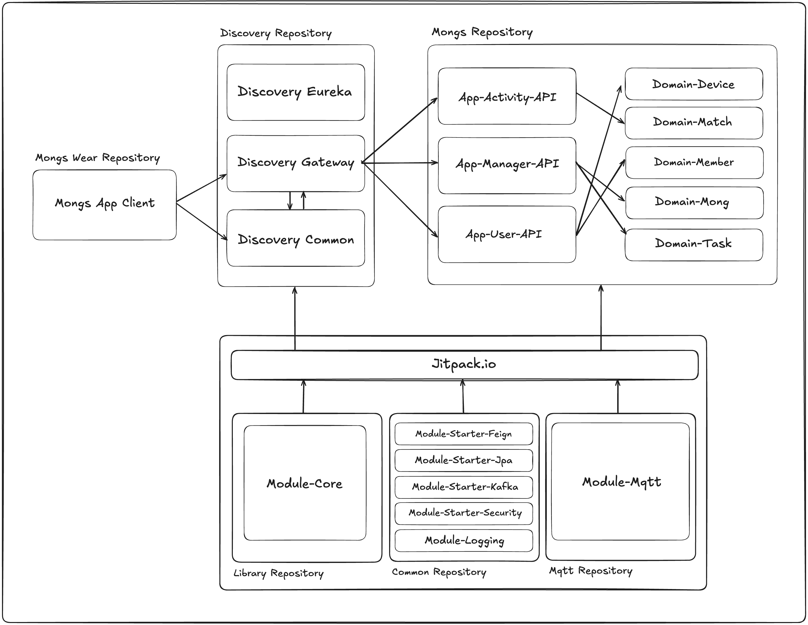

# 🚀 Mong Life

Mong Life는 우주 컨셉의 캐릭터를 기반으로 사람들에게 좋은 경험을 주기 위한 조직입니다. 사용자의 일상을 더 건강하고 즐겁게 만들기 위해 다양한 서비스를 개발하고 있습니다.

## 🏗 Repository Overview

### - [Monglife Discovery](https://github.com/monglife/monglife-discovery)
- 서비스마다 공통적인 기능들을 구현한 프로젝트 입니다.
- ```계정 정보```,```모바일 기기 정보```와 같이 서비스의 공통적인 정보들을 담당하여 처리합니다.
- 하나의 서비스가 아닌 다양한 서비스를 제공하기 위해 만들어졌습니다.

### - [Monglife Mongs API](https://github.com/monglife/monglife-mongs)
- 현재 서비스 중인 [Mongs : 걸음수로 키우는 다마고치](https://play.google.com/store/apps/details?id=com.mongs.wear) 서비스를 구현한 프로젝트 입니다.
- ```MSA(Micro Service Architecture)```로 구성되어 있습니다.
- 다양한 피드백으로 사용자와 함께 서비스를 키워가고 있습니다.

### - [Monglife Core Library](https://github.com/monglife/monglife-core)
- 공통적으로 사용되는 코드들을 담은 코어 라이브러리를 구현한 프로젝트 입니다.
- ```공통 코드```,```공통 응답 Body 클래스```,```공통 예외 클래스```,```응답 Enum 추상화 인터페이스```등과 같이 모든 서비스에서 사용되는 클래스들을 담고 있습니다.
- ```Mong Life```에서 구현되는 프로젝트에서는 본 라이브러리를 의존하여 개발을 진행합니다.
- 각 프로젝트는 다른 서비스를 제공하지만 ```예외 처리 방식```,```응답 Body 형식```컨벤션을 최대한 맞추기 위해 개발되었습니다.

### - [Monglife Mqtt](https://github.com/monglife/monglife-module-mqtt)
- 서비스에서 ```Mqtt```를 사용하기 위한 라이브러리를 구현한 프로젝트 입니다.
- ```Mong Life```에서 구현되는 프로젝트에서 ```Mqtt```를 사용하게 된다면 본 라이브러리를 의존하여 개발을 진행합니다.
- 어노테이션과 ```AOP```를 활용하여 ```Mqtt```를 직관적으로 사용할 수 있도록 개발되었습니다.
- 현재 [Monglife Common](https://github.com/monglife/monglife-module-common) 프로젝트에서 분리하는 작업을 진행중입니다.

### - [Monglife Common](https://github.com/monglife/monglife-module-common)
- 서비스에서 사용되는 공통 라이브러리들을 담은 프로젝트 입니다.
- ```feign client```,```jpa```,```kafka```,```logging```,```spring-security```등과 같은 라이브러리가 있습니다.
- 서비스마다 공통적인 설정을 ```@AutoConfiguration```을 통해 자동으로 설정하는 라이브러리가 포함되어 있습니다.
- 라이브러리를 의존함으로써 모든 설정이 자동으로 이루어져 특별한 설정 없이 사용할 수 있도록 개발되었습니다.

### - [Monglife Mongs Wear](https://github.com/monglife/monglife-mongs-wear)
- ```Mongs```서비스를 제공하는 안드로이드 웨어러블 앱을 구현한 프로젝트입니다.
- ```Native Android(Kotlin)```, ```Jetpack-Compose(Wear OS)```을 기반으로 개발되었습니다.
- 현재 [Google Play](https://play.google.com/store/apps/details?id=com.mongs.wear)에 출시되어 다운로드 수 ```1,000회```, 일간 사용자 ```100명```을 달성했습니다.

## 🛠 System Architecture
